<p>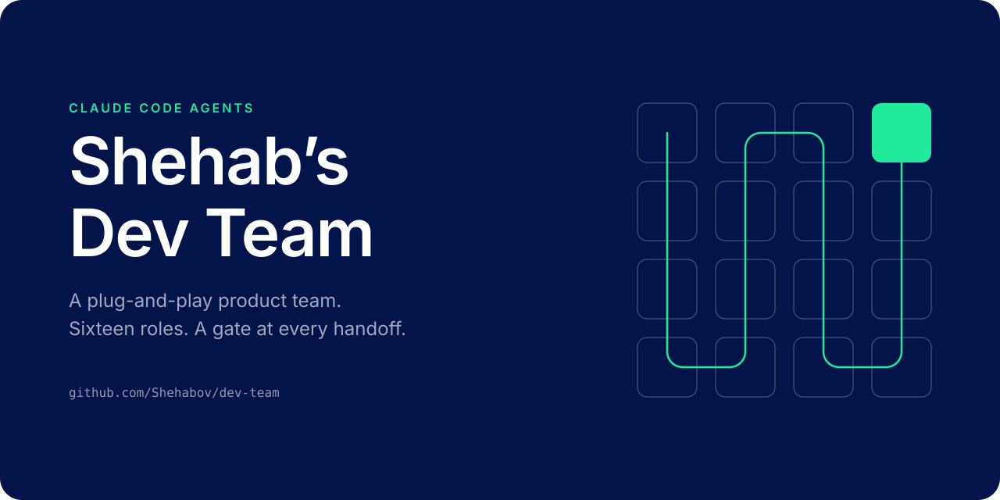</p>

Shehab's Dev Team is a plug-and-play product team for Claude Code. Sixteen agents plan,
design, build, review, test and release your product, and you lead them as the Product Lead.
Every handoff between two roles passes an independent gate, and every run leaves a ledger on
disk that proves which roles ran and whether their work was used.

Clone it and run `claude` in the folder. The orchestrator interviews you about your product,
writes the answers into `PROJECT.md`, and the team starts on your first brief. The one step
it cannot take for you is signing in to an MCP server, if your stack uses one.

## Start

The core needs Claude Code, git and node 20 or later. Nothing else is assumed until you say
it is there.

### A new product

On GitHub, choose "Use this template" on this repository. Or clone it and start your own
history:

```bash
git clone --depth 1 https://github.com/Shehabov/dev-team my-product
cd my-product
rm -rf .git
git init
```

### An existing product

Clone the team to a temporary folder and point the installer at your project. Read the dry
run first. It never overwrites a file of yours without `--force`, and it never replaces
`PROJECT.md` or `BUGS.md` at all.

```bash
git clone --depth 1 https://github.com/Shehabov/dev-team /tmp/dev-team
node /tmp/dev-team/scripts/install.mjs <path-to-your-project> --dry-run
node /tmp/dev-team/scripts/install.mjs <path-to-your-project>
```

If your project already has a `CLAUDE.md`, the team's manual lands beside it as
`CLAUDE.devteam.md`, and the installer prints the one import line to add. The team's MIT
notice travels with its files as `LICENSE-devteam`, and your own `LICENSE` is never touched.

### The first run

```bash
cd my-product
claude
```

`.claude/settings.json` makes the orchestrator the main thread, so the session you open is
the orchestrator. While `PROJECT.md` still holds a `TODO:` marker, it runs kickoff first,
asking about one section at a time and writing each answer into the file. After that, give
it a brief with an outcome it can check.

[Getting started](docs/GETTING-STARTED.md) walks through all three, with a sample brief.

## How a change moves

<picture>
  <source media="(prefers-color-scheme: dark)" srcset="assets/flow-dark.svg">
  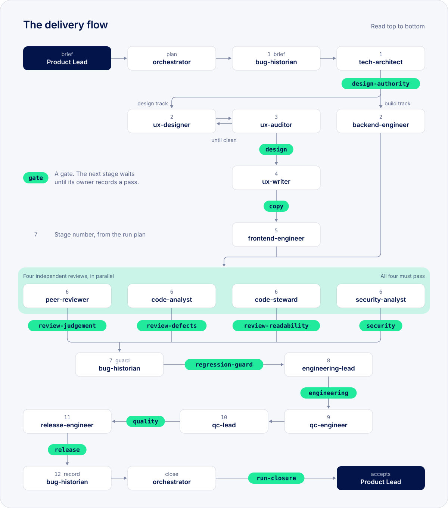
</picture>

Each role finishes by writing a handoff record that names what it read and what it
produced. Every gate has exactly one owner, and only that owner can record its result. A
stage does not start until every gate it depends on reads pass. The orchestrator plans only
the roles a change needs, and writes down why it left out each of the others.

## The team

<p>
<a href="docs/agents/orchestrator.md">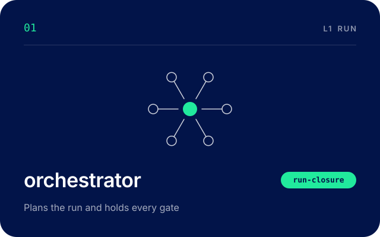</a>
<a href="docs/agents/bug-historian.md">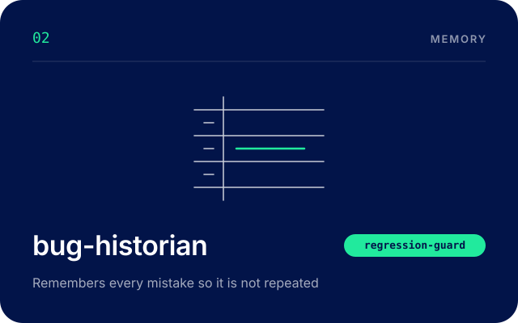</a>
<a href="docs/agents/tech-architect.md">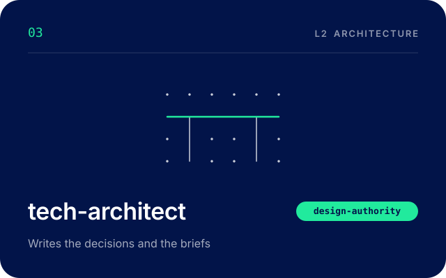</a>
<a href="docs/agents/ux-designer.md">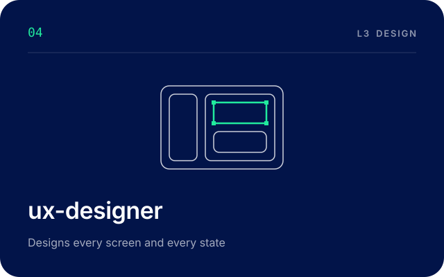</a>
</p>
<p>
<a href="docs/agents/ux-auditor.md">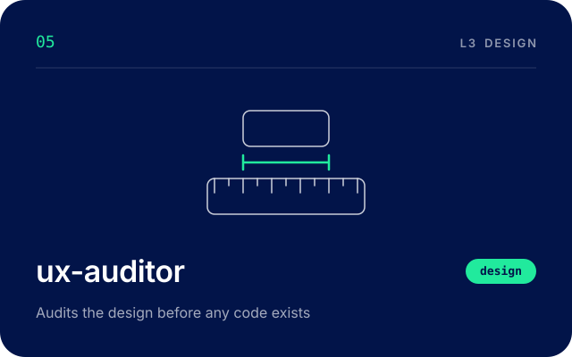</a>
<a href="docs/agents/ux-writer.md">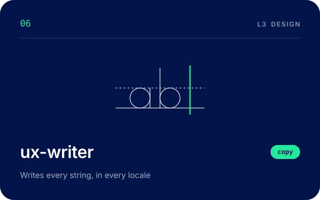</a>
<a href="docs/agents/backend-engineer.md">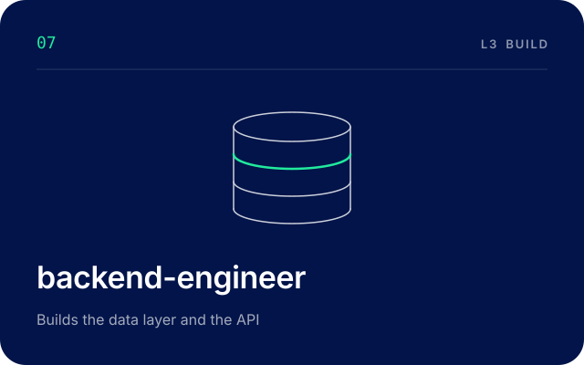</a>
<a href="docs/agents/frontend-engineer.md">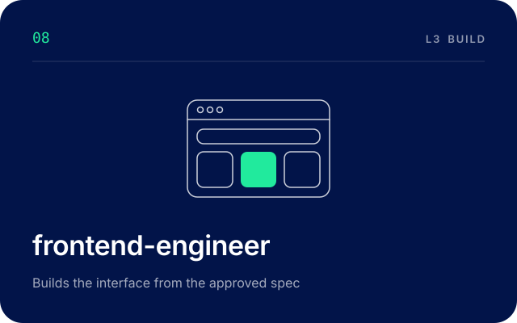</a>
</p>
<p>
<a href="docs/agents/peer-reviewer.md">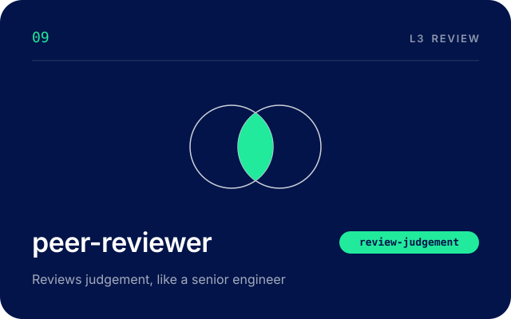</a>
<a href="docs/agents/code-analyst.md">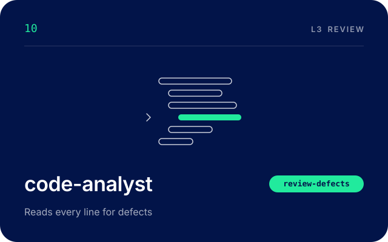</a>
<a href="docs/agents/code-steward.md"></a>
<a href="docs/agents/security-analyst.md">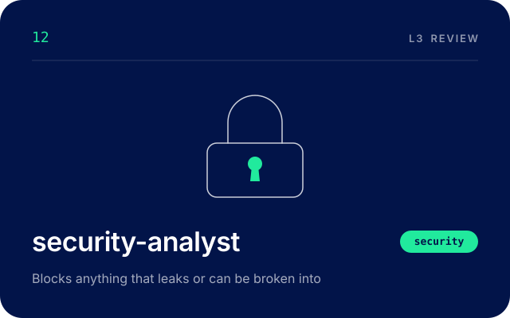</a>
</p>
<p>
<a href="docs/agents/engineering-lead.md">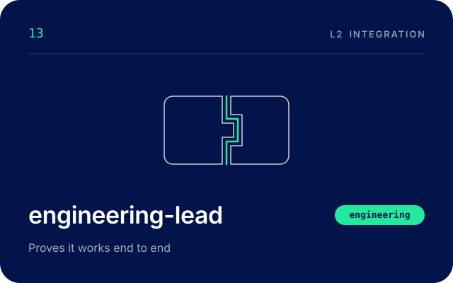</a>
<a href="docs/agents/qc-engineer.md">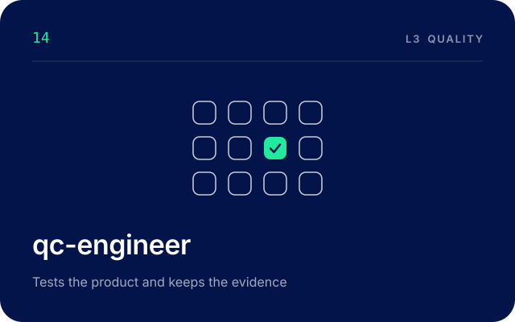</a>
<a href="docs/agents/qc-lead.md">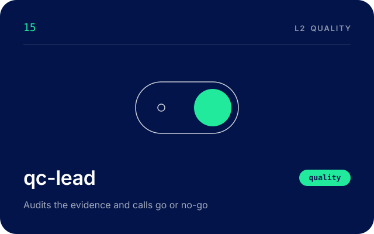</a>
<a href="docs/agents/release-engineer.md">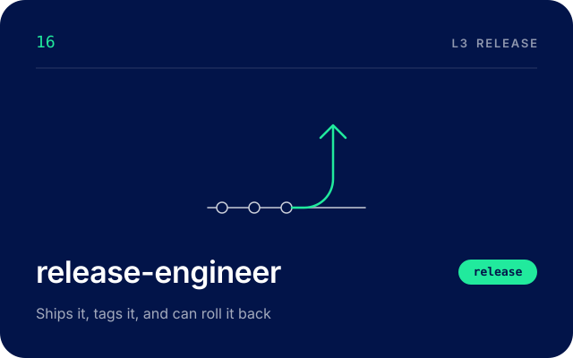</a>
</p>

<picture>
  <source media="(prefers-color-scheme: dark)" srcset="assets/roster-dark.svg">
  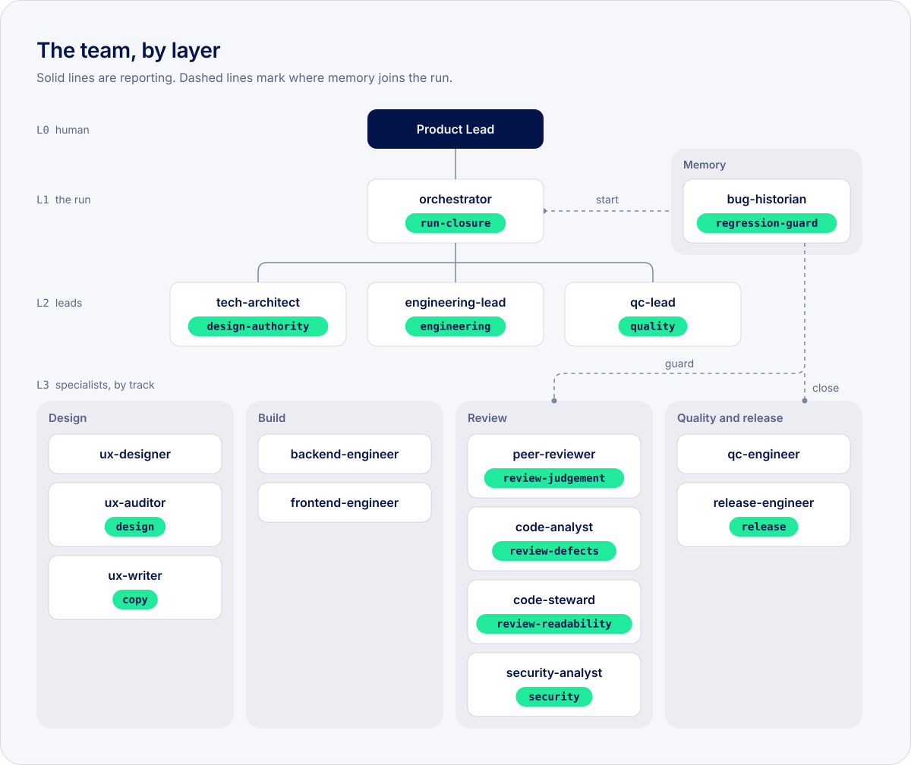
</picture>

You sit at the top. The orchestrator is the only role that dispatches, so a stage it did not
start reads as a skipped gate. bug-historian stands outside the layers as the team's memory,
and passes through every run three times.

| # | Agent | What it does | Gate |
|---|---|---|---|
| 01 | [orchestrator](docs/agents/orchestrator.md) | Plans the run and holds every gate | `run-closure` |
| 02 | [bug-historian](docs/agents/bug-historian.md) | Remembers every mistake so it is not repeated | `regression-guard` |
| 03 | [tech-architect](docs/agents/tech-architect.md) | Writes the decisions and the briefs | `design-authority` |
| 04 | [ux-designer](docs/agents/ux-designer.md) | Designs every screen and every state | none |
| 05 | [ux-auditor](docs/agents/ux-auditor.md) | Audits the design before any code exists | `design` |
| 06 | [ux-writer](docs/agents/ux-writer.md) | Writes every string, in every locale | `copy` |
| 07 | [backend-engineer](docs/agents/backend-engineer.md) | Builds the data layer and the API | none |
| 08 | [frontend-engineer](docs/agents/frontend-engineer.md) | Builds the interface from the approved spec | none |
| 09 | [peer-reviewer](docs/agents/peer-reviewer.md) | Reviews judgement, like a senior engineer | `review-judgement` |
| 10 | [code-analyst](docs/agents/code-analyst.md) | Reads every line for defects | `review-defects` |
| 11 | [code-steward](docs/agents/code-steward.md) | Keeps the code readable for whoever is next | `review-readability` |
| 12 | [security-analyst](docs/agents/security-analyst.md) | Blocks anything that leaks or can be broken into | `security` |
| 13 | [engineering-lead](docs/agents/engineering-lead.md) | Proves it works end to end | `engineering` |
| 14 | [qc-engineer](docs/agents/qc-engineer.md) | Tests the product and keeps the evidence | none |
| 15 | [qc-lead](docs/agents/qc-lead.md) | Audits the evidence and calls go or no-go | `quality` |
| 16 | [release-engineer](docs/agents/release-engineer.md) | Ships it, tags it, and can roll it back | `release` |

Every agent runs on the model your session runs on, and each one has a page that sets out
when it runs, what it reads and writes, and what its gate asks for.

## Every agent runs the same loop

<picture>
  <source media="(prefers-color-scheme: dark)" srcset="assets/loop-dark.svg">
  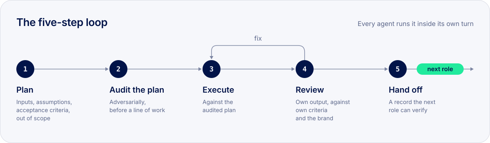
</picture>

Every agent works through these five steps on every task, inside its own turn. The second
step carries the most weight. Before any work, the agent reads its own plan as a critic
would, names what it assumed without checking and what the next role would reject, and
records what it changed. Review sends it back to execute until its own acceptance criteria
hold, and the handoff is the record the orchestrator routes on. The loop is defined in
[team-protocol](.claude/skills/team-protocol/SKILL.md).

## Twelve gates, four independent reviews

<picture>
  <source media="(prefers-color-scheme: dark)" srcset="assets/gates-dark.svg">
  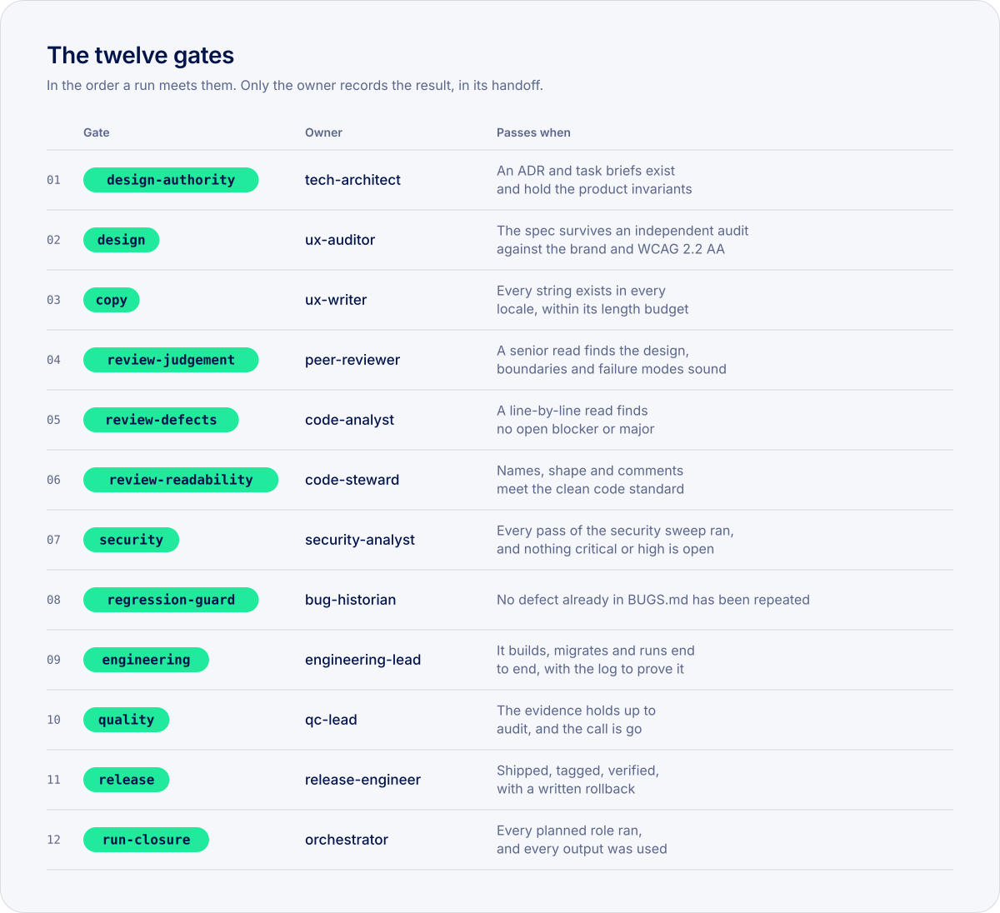
</picture>

peer-reviewer, code-analyst, code-steward and security-analyst read the same change at
stage 6, each for its own concern. None of them reads another's verdict before filing its
own, so no reviewer leans on another's judgement. They cannot edit the code they review
either: they write findings, and the author fixes them. All four must pass.

Then bug-historian runs the regression guard. At the start of the run it briefed every role
on what has already gone wrong on the surfaces the change touches. At stage 7 it runs the
detection command of every known defect over the whole tree, and a defect that comes back
fails the gate. A repeat is treated as worse than a new defect, because it means the register was
written and nobody read it. A pattern that reaches a third occurrence goes to you as a
process failure.

The team was hardened on a real product build. The mistakes made there became the twelve
seed standing rules in [BUGS.md](BUGS.md), so your project starts with them in force.

## Security is part of the flow

<picture>
  <source media="(prefers-color-scheme: dark)" srcset="assets/security-dark.svg">
  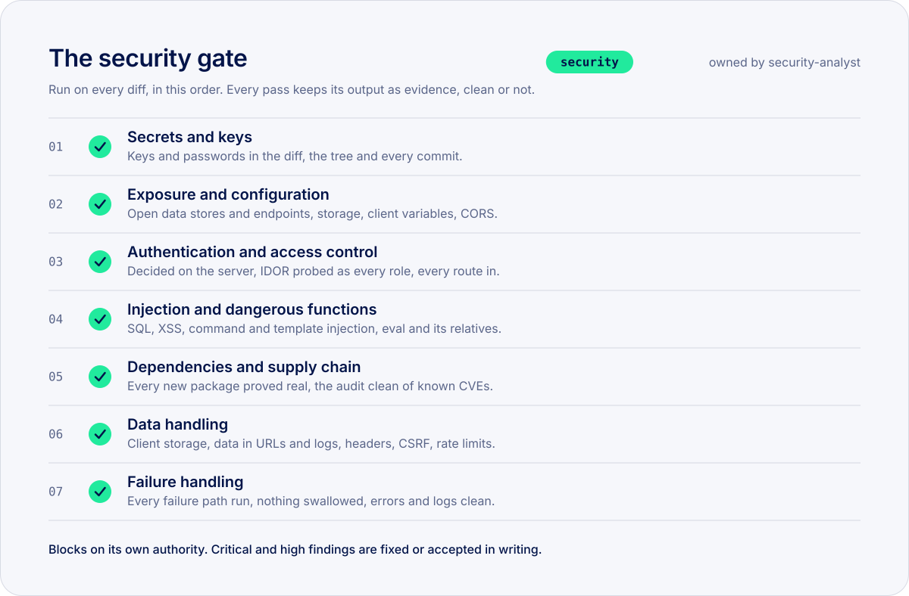
</picture>

security-analyst holds the security gate on every change. Its sweep has seven passes, run
in a fixed order with the widest blast radius first, and the gate blocks on its own
authority.

- Secrets are searched for in every commit on every branch, as well as in the change. A key
  that leaked is rotated, because deleting the line does not take it back.
- A critical in the first two passes stops the sweep. A leaked key or an open data store
  walks past every control the later passes would check.
- Access control is decided on the server and probed as every role, against every read,
  write and named action, then sent again from outside with the public client key.
- A request for another account's record is refused as though the record did not exist,
  since a 403 tells the caller it is there.
- Every new package is proved to exist, and to be the one intended, before it is trusted. A
  name the registry does not know is free for anyone to register tomorrow.
- Probes read and never change. They run inside a transaction that rolls back, against a
  local build, or in a disposable environment.
- Evidence never carries a secret. Every scan that can print a credential is redacted
  before it is saved.
- Critical and high findings block. Each one is fixed and proved again with the same probe,
  or accepted by you in writing, with a compensating control and an expiry, as a decision
  line in the run's ledger.

The full catalogue, readable without the skill open, is in the
[security checklist](docs/SECURITY-CHECKLIST.md).

## Make it yours

The team is a set of plain files, and each change below is an edit to one of them.

| To change | Edit |
|---|---|
| What the team knows about your product | [PROJECT.md](PROJECT.md), twelve sections filled at kickoff. Agents cite a section by its heading and never copy its values, so one edit reaches every role. |
| Colours, type, spacing and copy rules | Your brand spec, drafted from [templates/BRAND.md](templates/BRAND.md). The design roles take every value from it and invent none. |
| The stack | `PROJECT.md § Stack pack`. [stack-nextjs-supabase](.claude/skills/stack-nextjs-supabase/SKILL.md) ships as the default and is optional. Name your own `stack-*` pack, or `none`, and the roles work from your commands. |
| Extra craft for a role | Companion skills from third parties. An agent uses one where it is installed and never depends on it. |
| Models | Every agent ships with `model: inherit`. To pin one role, change that line in its file. |
| MCP servers | No agent carries a tools list, so a server you connect reaches every role that can use it. |

[Customising](docs/CUSTOMISING.md) covers each of these, and adding or removing a role.
[Skills](docs/SKILLS.md) lists every skill, which agents load it, and the companions each
role can use.

## What is inside

```text
.claude/
  agents/                        the sixteen agents
  skills/team-*/                 fourteen house skills
  skills/stack-nextjs-supabase/  the default stack pack, optional per project
  settings.json                  the orchestrator as main thread, and the permissions
.devteam/                        run machinery: templates, the gate sync, the utilisation check
.github/workflows/check.yml      runs scripts/check.mjs on every push and pull request
assets/                          the art on this page
docs/                            a page per agent, the workflow, skills, security, guides
templates/BRAND.md               the brand spec template
scripts/                         the installer, the repository checks, the art generator
CLAUDE.md                        the operating manual, which imports PROJECT.md
PROJECT.md                       your project profile, filled at kickoff
BUGS.md                          the defect register, with twelve seed standing rules
SECURITY.md                      how to report a vulnerability in this repository
LICENSE                          MIT
```

## The ledger

Every run gets its own folder under `.devteam/runs/`, holding the plan, an append-only
ledger, each role's plan, review and handoff, and the evidence behind every gate. Git
ignores it, and what has to outlast a run goes into `BUGS.md` and the decision records.
After every stage the orchestrator runs the utilisation check, a node script that reads
only the plan and the handoffs and reports, among other things, a planned role that never
ran and an output no later role read. You can run it yourself:

```bash
node .devteam/bin/utilisation-check.mjs .devteam/runs/<run-id>
```

[The run machinery](.devteam/README.md) explains every file and every finding, and
[the workflow](docs/WORKFLOW.md) sets out the stages and gates in full.

---

Built by [Shehab Beram](https://github.com/Shehabov). MIT licence, in [LICENSE](LICENSE).
To report a vulnerability, see [SECURITY.md](SECURITY.md).
