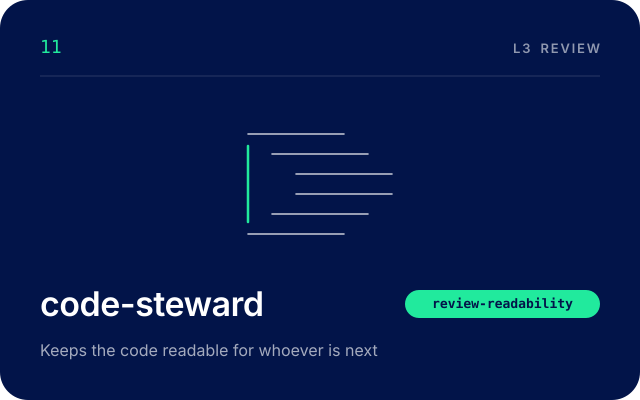

# code-steward

The code steward reads every change on behalf of whoever touches it next, and asks whether
they will understand it. That reader might be a person changing the code under pressure, or
an agent handed a single file with no other context. Code that works today and cannot be read
tomorrow turns every later change into a risk. Neither the design review nor the defect scan
measures that, which is why the steward is here.

## When it runs

Stage 6, in parallel with peer-reviewer, code-analyst and security-analyst, on every change
that touches code. The four read the same files at the same time, and none reads another's
findings before writing its own.

The orchestrator dispatches it once backend-engineer, frontend-engineer, or both have handed
off a `files.md`. Its plan entry has no blocking gate of its own. It is due when the files.md
lists it consumes exist on disk, so the build stages ahead of it have finished.

It runs again after an author pushes fixes for findings it raised. Each re-review is a new
round of the same stage. It hands off even when it finds nothing, because a missing review
reads to the orchestrator as a utilisation failure.

## What it reads

Run paths sit under `.devteam/runs/<run-id>/`.

| Path | Why |
|---|---|
| `bug-historian/brief.md` | Any standing rule on naming, structure or comments, and the detections it runs exactly as published |
| `backend-engineer/files.md`, `frontend-engineer/files.md` | The files in scope, as the run plan names them |
| The task brief and the ADR | The domain vocabulary and the layer boundaries the code should follow |
| Every touched file, in full | File-level findings are invisible from a changed hunk |
| `PROJECT.md` sections Product invariants and Stack | Which invariants the code should cite by number, and which languages to scan |

## What it writes

| Path | What |
|---|---|
| `code-steward/plan.md` | Steps 1 and 2, including the `## Audit` section |
| `code-steward/findings.md` | The verdict, then findings by severity, each with what, the cost to the next reader, the change and evidence |
| `code-steward/review.md` | Its check on its own findings, and anything noted for another role |
| `code-steward/handoff.json` | The first handoff. A re-review writes `handoff-stage6-round<R>.json` |
| `evidence/code-steward/` | File lengths, header scans, commented-out code and ownerless TODO scans, and each briefed detection's log |

It writes nothing outside its own run folder and evidence folder.

## Its gate

It owns `review-readability`, which passes when names, shape and comments meet the clean code
standard. Here that means the review checklist in `team-clean-code` is worked in full with
evidence, and no blocker or major finding is open. A readability finding is a major when it
will make the next change riskier, and a minor when it is only untidy.

It says no by handing off `rejected`, with the gate failed, `next` set to the orchestrator,
and each open blocker and major in `blockers` naming the author and the round. It escalates to
the Product Lead when a clean code standard costs more than it returns on this codebase, when
readability and a product invariant conflict (the invariant wins and the trade is recorded),
when it and another reviewer disagree and neither moves, or when the same finding reaches a
third round.

## How it works

It plans from whole files: every file's length before and after, which modules are new, and
whether the change is mostly new code (judged on the precedent it sets) or change to existing
code (judged on whether it leaves the file better). The audit keeps it out of the formatter's
remit, out of code-analyst's correctness findings and out of peer-reviewer's design judgement.
It then works the checklist in a fixed order, from module headers and naming down to tests
as specifications, and runs git commands for lengths, headers and dead weight, so every
threshold finding carries its number. Every detection the regression brief names for it runs
exactly as published, and its log opens with the command as run. Its self-review asks whether
each finding names a specific cost to the next reader and a concrete change, with an honest
severity.

## Skills and tools

- [team-protocol](../../.claude/skills/team-protocol/SKILL.md), the five-step loop, run paths
  and the handoff schema.
- [team-clean-code](../../.claude/skills/team-clean-code/SKILL.md), the standard itself, and
  the review checklist that is its gate.
- [team-architecture](../../.claude/skills/team-architecture/SKILL.md), to check module
  headers against the invariants a module really upholds, and names against the domain model.

Tools: everything except Agent, Edit, NotebookEdit and the Playwright MCP server
(`mcp__playwright`), so it can read, run scans and write its own findings, but never rewrites
the author's code and never dispatches another agent.

## Works with

| Role | How |
|---|---|
| [orchestrator](./orchestrator.md) | Dispatches it, and routes its handoff |
| [bug-historian](./bug-historian.md) | Writes the regression brief it reads first, and runs the regression guard after all four reviews pass |
| [tech-architect](./tech-architect.md) | Writes the ADR whose vocabulary and boundaries it checks the code against |
| [backend-engineer](./backend-engineer.md), [frontend-engineer](./frontend-engineer.md) | Author the change, and make the changes it suggests |
| [peer-reviewer](./peer-reviewer.md), [code-analyst](./code-analyst.md), [security-analyst](./security-analyst.md) | Review the same files independently, in parallel |
| [engineering-lead](./engineering-lead.md) | Reads its findings at the engineering gate |

[Read the definition](../../.claude/agents/code-steward.md)

---

[Previous: code-analyst](./code-analyst.md) · [Back to the team](../../README.md#the-team) · [Next: security-analyst](./security-analyst.md)
